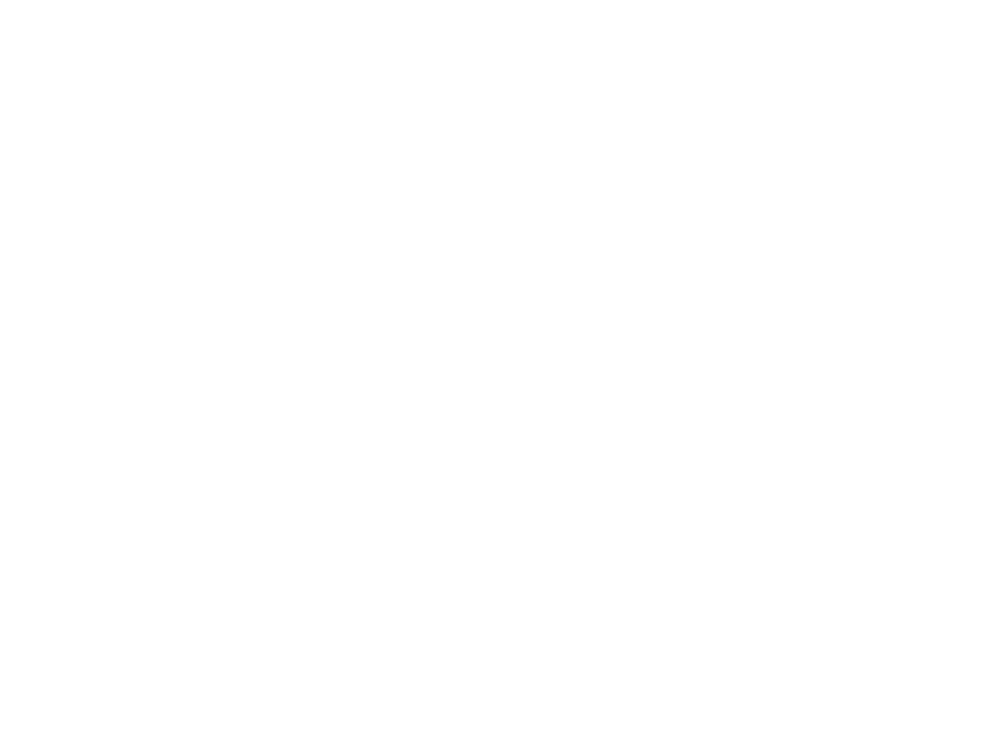

# Trabalho de Software Básico

## Integrantes:
<ul>
  <li><i>Diego Enrique da Silva Lima</i></li>
  <li><i>Luca Mascarenhas Plaster</i></li>
  <li><i>Marcos Reges Mota</i> (Regittos)</li>
</ul>

## Tabela de Conteúdo

* [Integrantes](#integrantes)
* [Tabela de conteúdos](#tabela-de-conteúdos)
* [Descrição do Projeto](#descrição-do-Projeto)

## Descrição do Projeto

  O trabalho se baseia na implementação de um tradutor de uma linguagem simples (chamada de BPL – Bruno’s Programming Language) para Assembly.

 execute gcc -o main main.c 

  
 ./main <test.txt > out.txt 

